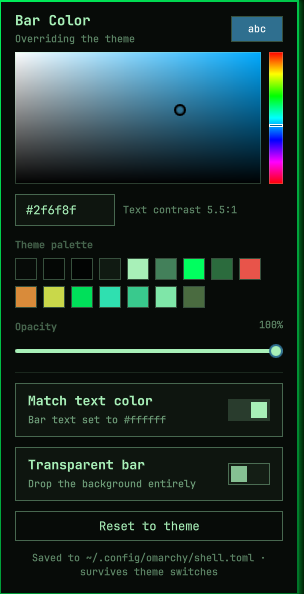

# Bar Color

Recolor the Omarchy bar from the bar itself. A swatch sits on the right side of
the bar showing the color the bar is currently wearing; click it for the
picker.



- **Hue/saturation field and hue rail** — the standard HSV square, live while
  you drag.
- **Theme palette presets** — the active theme's own colors, with the theme's
  bar color first, so a recolor can stay inside the palette.
- **Hex field** — type or paste `#rrggbb`.
- **Opacity** — makes the bar translucent over the wallpaper.
- **Transparent bar** — the built-in no-background mode. While it is on the
  bar paints nothing, so the panel dims the picker and says so rather than
  letting you choose a color that does nothing.
- **Match text color** — keeps bar text readable against whatever you pick,
  preferring a color the theme already uses and falling back to plain white or
  black only when neither theme color clears WCAG AA. The panel shows the
  contrast ratio it achieved.
- **Reset to theme** — removes the override; the bar goes back to following
  the theme.

## Where the color goes

`~/.config/omarchy/shell.toml`, the machine-level override the shell layers on
top of the active theme:

```toml
[bar]
background       = "#3b6ea5"
background-alpha = 0.9
text             = "#0d1117"   # only with "Match text color" on
```

That file is watched by the shell, so a pick applies immediately — no restart,
no reload command. It is also the layer that theme switching does not touch,
so the color survives `omarchy theme set` and `omarchy update`.

The file is shared (`omarchy display text size` keeps `[font] base-size`
there), so the plugin edits it line by line: other sections, comments, and
column alignment are left exactly as found, and a reset that empties `[bar]`
removes the section header too.

Transparency is bar state rather than theme state, so that switch goes through
`omarchy bar transparent` and lands in `shell.json` like it does from the CLI.

## Interactions

| Where | Action |
|---|---|
| Bar swatch | left = open the picker · right = reset to the theme |
| Panel | `←`/`→` walk the hue · `↑`/`↓` the brightness |
| Panel | `c` match text color · `t` transparent bar · `r` reset · `Esc` close |
| Anywhere | `omarchy-shell bar-color toggle` — bind it to a key |

## Install

```sh
omarchy plugin add <repo-url> --enable --yes    # or copy into ~/.config/omarchy/plugins/
omarchy bar move fixlixpender.bar-color --section right
```

## Notes

`Match text color` writes `[bar] text`, which the shell also uses for the bar
foreground everywhere — including the accent color of sliders in other bar
popups. That is the key's normal meaning; turn the switch off to leave bar text
to the theme.

## Development

```sh
node --test tests/                                      # the color math and the TOML editor
/usr/lib/qt6/bin/qmllint -I /usr/share/omarchy/shell *.qml
omarchy plugin validate .
```

`qmllint` cannot resolve `qs.Commons` / `qs.Ui` outside Quickshell, so
unresolved-import warnings are expected — the first-party plugins produce the
same ones. Read it for syntax errors and genuine property mistakes.

| File | Role |
| --- | --- |
| `Model.js` | All logic: color math and the shell.toml editor. No QML — `node --test` runs it directly. |
| `Store.qml` | The files on disk: the shell.toml override it writes, plus the theme files and `shell.json` it only reads. |
| `ColorField.qml` | The saturation/value field and hue rail. |
| `Panel.qml` | The popup. Owns the draft color. |
| `BarWidget.qml` | The bar swatch. |

Two things worth knowing before changing it:

**The draft is HSV, not hex.** Recovering a hue from a hex color is lossy at
the grey and black edges of the field, so a picker that round-tripped through
hex on every drag would fight the cursor. `Panel.qml` keeps hue, saturation and
value; hex is derived.

**Every write comes back.** The shell.toml watcher reports our own saves a beat
after we make them. `Store.lastWritten` is how the panel tells its own echo
from a real external edit — adopting the echo mid-drag would jerk the cursor
back to whatever the last coalesced write caught. Drags are coalesced to one
write per ~90ms for the same reason.

## License

MIT
